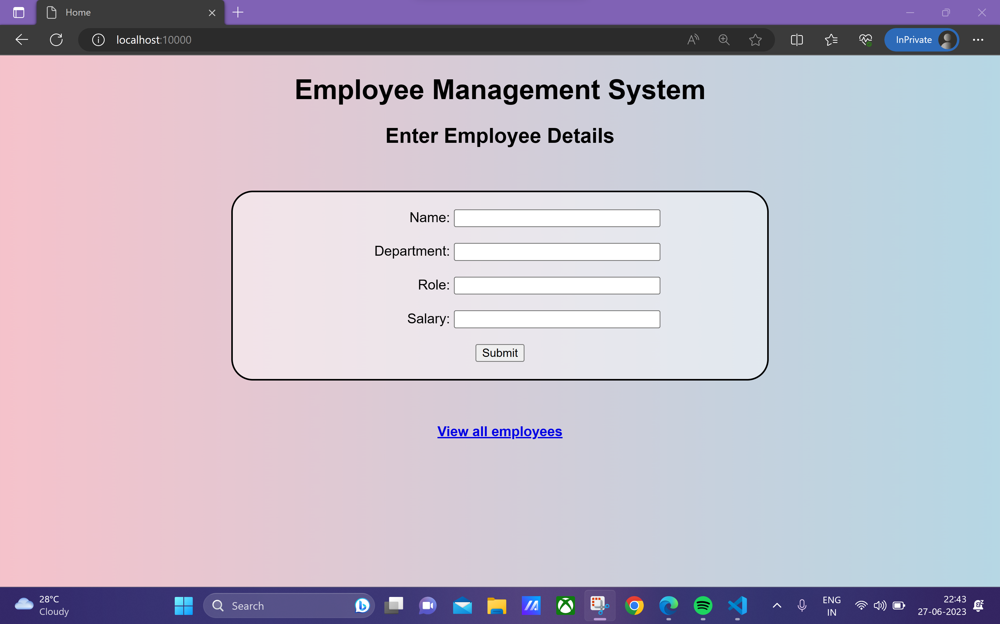

# Employee Management CRUD application
## By Subhodeep Sarkar

*This is the miniproject for C361 Wiley Edge. It is a employee management web application made using Flask*

### Features
- Form validation using Regular Expression
- Docker image available
- Easy UI navigation

### Demonstration

 

### Docker, Jenkins, Kubernetes and AWS

*Dockerfile, Jenkinsfile and Kubernetes configuration file (emp-mgmt.yaml) can be found in the "docker" branch*

 

**To pull docker image**
`docker pull h4ck3rd33p/employee-management-flask-app:latest`

 

**To run docker container**
`docker run -d -p <your_port>:10000 
h4ck3rd33p/employee-management-flask-app:latest`

 

**To deploy Kubernetes Cluster locally**
- install minikube 
- install kubectl-cli
- run `minikube start`
- To check if minkube is running `kubectl get node`
- run `kubectl apply -f emp-mgmt.yaml`
- open browser and open 'http://employeelovescode.com`

 

**To deploy Kubernetes Cluster on AWS EKS**
- install aws
- Create IAM user with EKS permissions
- Create Access keys for that user and store it
- run `aws configure`
- enter your access and secret access keys
- enter your nearest region
- install eksctl
- run `eksctl create cluster --name <cluster_name> --nodes <max_nodes> --nodegroup-name <nodegroup_name> --node-type <instance_type>`
- check using `kubectl get node`
- run `kubectl apply -f emp-mgmt.yaml`
- get service ip using `kubectl get service emp-mgmt`
- open browser and open `http://<ip>`